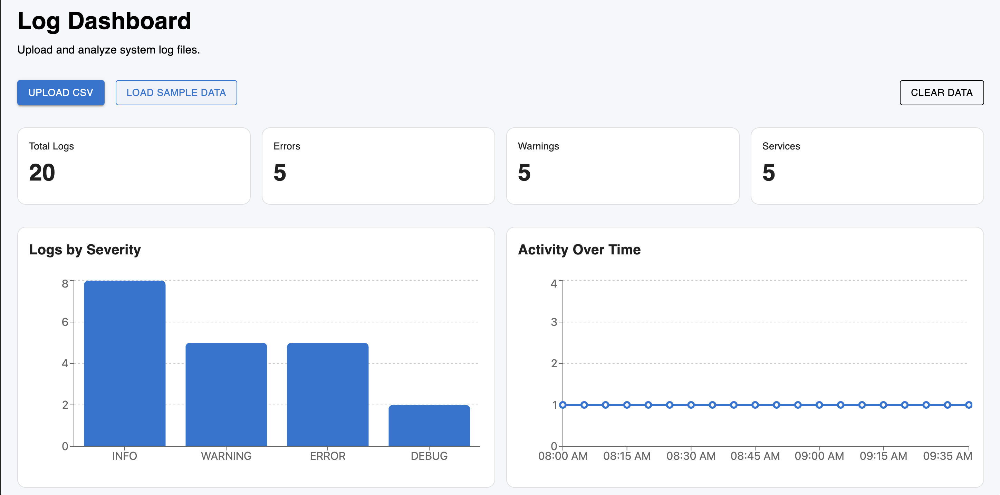

# System Log Analyzer

A responsive web application for uploading, analyzing and visualizing system log files in CSV format.

The dashboard processes log data directly in the browser and provides summary metrics, severity distribution, activity over time, search and filtering tools.

## Features

- CSV file upload and parsing
- Sample log dataset
- Log format validation
- Total log count
- Error and warning metrics
- Service count
- Search by service or message
- Filtering by severity
- Severity distribution chart
- Activity over time chart
- Responsive log table
- Clear data functionality
- Responsive interface

## Screenshot



## Tech Stack

### Frontend

- React
- TypeScript
- Vite
- Material UI

### Data Processing

- Papa Parse

### Data Visualization

- Recharts

### Development

- ESLint
- Git
- GitHub

## Expected CSV Format

The application expects a CSV file containing the following columns:

```text
timestamp
service
severity
message
```

Example:

```csv
timestamp,service,severity,message
2026-10-02T08:00:00,auth-service,INFO,User authentication successful
2026-10-02T08:10:00,database,WARNING,High connection pool usage
2026-10-02T08:15:00,auth-service,ERROR,Invalid authentication token
```

Supported severity values:

```text
INFO
WARNING
ERROR
DEBUG
```

Rows that do not contain the required information or use an unsupported severity are ignored.

## Dashboard Metrics

The dashboard calculates:

```text
Total Logs
Errors
Warnings
Services
```

Metrics are calculated automatically whenever a valid CSV file is loaded.

## Log Visualization

### Logs by Severity

Displays the number of log entries grouped by severity.

### Activity Over Time

Displays log activity according to the timestamps contained in the uploaded dataset.

## Search and Filtering

Logs can be searched using:

```text
Service name
Log message
```

The severity filter supports:

```text
All
INFO
WARNING
ERROR
DEBUG
```

## Sample Data

A sample dataset is included in:

```text
public/sample-logs.csv
```

The **Load Sample Data** button can be used to test the application without uploading a file.

## Project Structure

```text
system-log-analyzer/
├── docs/
│   └── screenshots/
│       └── dashboard.png
│
├── public/
│   └── sample-logs.csv
│
├── src/
│   ├── components/
│   │   ├── ActivityChart.tsx
│   │   ├── FileUpload.tsx
│   │   ├── LogChart.tsx
│   │   ├── LogTable.tsx
│   │   └── StatCard.tsx
│   │
│   ├── types/
│   │   └── log.ts
│   │
│   ├── App.tsx
│   ├── index.css
│   └── main.tsx
│
├── package.json
└── README.md
```

## Running Locally

Clone the repository:

```bash
git clone https://github.com/LeslieSc/system-log-analyzer.git
```

Enter the project:

```bash
cd system-log-analyzer
```

Install dependencies:

```bash
npm install
```

Start the development server:

```bash
npm run dev
```

Vite will provide a local development URL, typically:

```text
http://localhost:5173
```

## Build

Create a production build with:

```bash
npm run build
```

## Lint

Run ESLint with:

```bash
npm run lint
```

## Deployment

The application is deployed on Render as a static site.

Production URL:

[System Log Analyzer](https://system-log-analyzer-s629.onrender.com)

## Future Improvements

Possible future additions include:

- Support for additional CSV column formats
- Custom severity mappings
- Date range filtering
- Service-specific analytics
- Exporting filtered results
- Larger dataset optimization

## Author

**Leslie Sosa**

Information Technology and Telecommunications Engineering student.

GitHub: [LeslieSc](https://github.com/LeslieSc)

## License

This project was created for educational and portfolio purposes.
